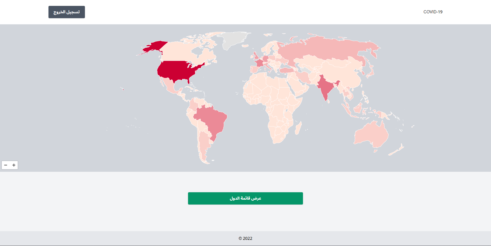

## Setup process

### Steps

1. Clone this repository using GIT:

```
git clone https://github.com/irakan/COVID19.git
```

2. Change to the new folder

```
cd covid19-spa
```

3. Copy the .env-example to .env on directory /api

```
cp api/.env.example api/.env
```

4. You can replace environment variables in .env file ( in /api directory ), just consider the docker-compose.yml file to keep environment consistence.

5. Build Docker images & the containers

```
docker-compose up -d --build
```

6. Generate Laravel Key `docker-compose exec app php artisan key:generate`
7. Run MySQL DB Migrations & seed the database `docker-compose exec app php artisan migrate:fresh --seed`

8. Now you access the frontend by using: `localhost:3000`, and API on `localhost/api`. You can also access Horizon on `localhost/horizon`

\*The user must be logged in to be able to see (Fill data, add country and edit country buttons) in the countries index page:

```
admin@test.com
123456
```

## Running tests

`php artisan test`
